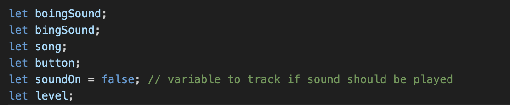
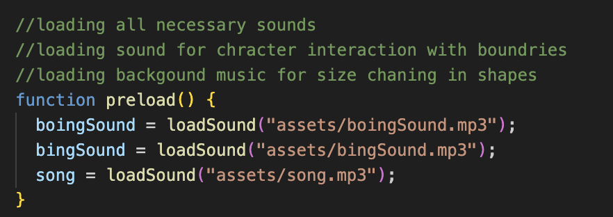
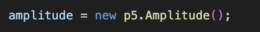
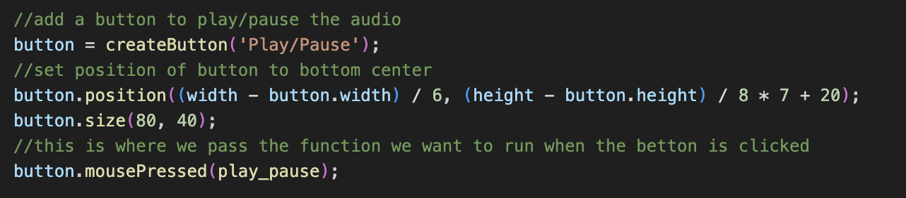
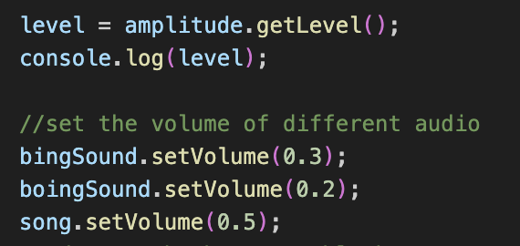
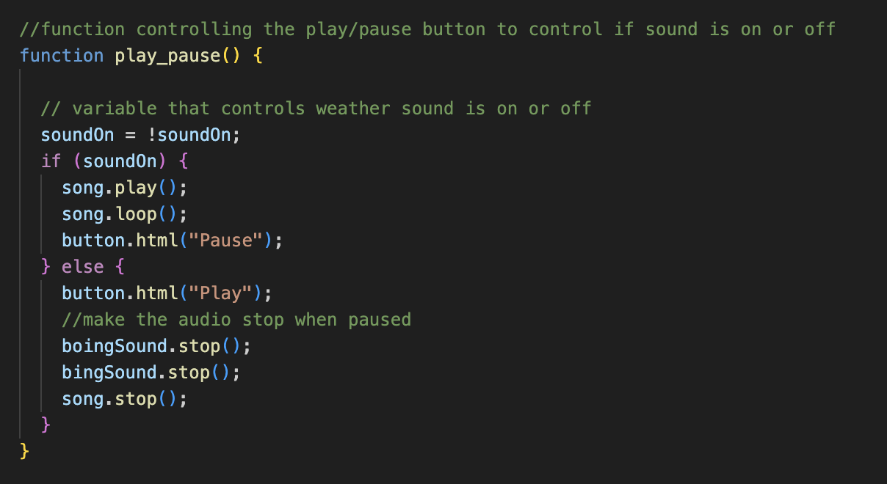
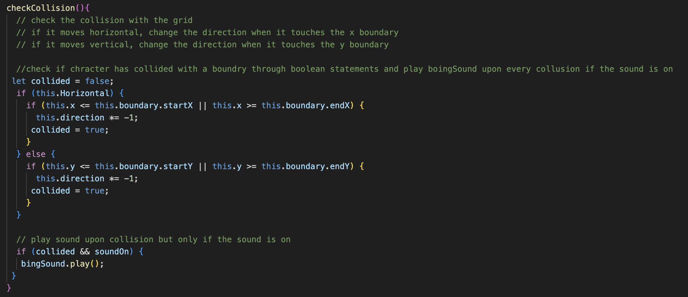
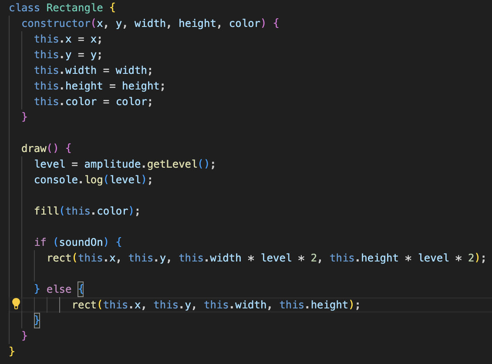
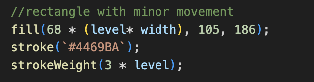

<h1> Individual Task: Audio </h1>
<h2>zdzi0994</h2>

<h3>Aims: </h3>

<h4>1. Add a sound effect which is activated upon character interaction with a boundry - replicating an arcade game. there are two types of characters, each has its own interaction sound.</h4>
<h4>2. Add a background song for which elements in the code react to the change in amplitude. The elemetns changing are the line segment sizes pusating and the character with the eyes has a small color shift and shange is size to one of the squares</h4>

To interact with the canvas simply press the play/pause button. Once you click it, the canvas will reveal changes which are due to the programmed sound. You can always pause the sound and the code will revert to the origianl state. 

<h3>Aim 1</h3>

<h4>Global Variables</h4>
<h3>Global variables are defined in order to work with audio. Most importantly the var names for the 3 sounds that will be used, but also a button variable to allow user to play or pause sound, a variable to hold the amplitude level and a boolean variable to control the on and off state of the sound thoruhgout the document.</h3>

<h4>Preload</h4>
<h3>I made sure to preload all the sound and music I wanted to use before setup() and draw() so they are ready for user upon need.</h3>

<h4>Setup()</h4>
<h3>In the setup function I included the p5.js function denote the amplitude from the sound to register in the variable "aplitude". Additionally, I also created a button which plays and stop the audio. In setup there are style choices, but later on I also created a function which controls how the button acts and what it does. I inicialise the function by attaching it to a mouseClicked p5.js function. </h3>

<h4>Button Details</h4>

<h4>Volume</h4>
<h3>I set specific volume settings for each sound as they were all very different, I wanted the sound to be more smooth. I also wanted the volume of each sound to be relevant to what they were doing. For exmaple I wanted to make sure the volume of the collusion could be heard but that it did not overpower the music itself. I also wanted there to be a distinction between the two different collisions in each chracter.</h3>

<h4>Button Functions</h4>
<h3>To make sure that all the sound plays and pauses upon clicking the button, I created a boolean for telling the system weather the sound is on or off at the moment. While the sound effects for the collision did not need to be looped as they played once every time a collision happened and stopped, which is declared further in the code, I looped the song within the soundOn timeframe to make sure the song does not end and stop playing even if the user still did not press pause on the sound.</h3>

<h4>Collision Sounds</h4>
<h3>To programme the collusion sound to be played when a character interacts with a bountry I manipulated the checkCollusion() function from the group code. This function already used a if/else statement so I incorporated the sound into that. Here I used boolean structure to tell the code when to play the sound. Declaring first that that there is no interaction by creative the variable collided = false. Then, for both the y checking boundry and x checking boundry I indicate that that is collided = true. Now the system knows the collision points. Using that variable, I created another if satement declaring the action to play the sound when collusion is true. Additionally, the argument to play the sound is also only when the soundOn is true for the button.</h3>

<h3>While my idea was to use a boolean, I could not tertermin the correct placement of the boolean figures. I aknowledge the help of chatGPT here.</h3>

<h4>Visualising Amplitude</h4>

<h3>Line Segment Growth</h3>

<h3>To create a more dynamic background, I made the size of the rectangles in the line segments grow and shrink depending on the apmplitude. To do this, first I created a variable to continuously hold the level of the amplitude. This varaible (called "level") could then be inputed into various elements in the code to change the way it looks and behaves depending on the sound output. I collected this sound level within the draw function of the initially declared rectangle constructer which builds the line segments. Finally, to make it work, I used an if/else statement to control the size based on the soundOn boolean variable from the play/pause function. Wehn calling to draw the rectangles, the code either normally prints as before, or the variables get multiplied by the level (also multiplied by 2 as the aplitude is very small 0-1) to make a more visible chagne. </h3>

<h3>Chara2 Growth + Fill</h3>

<h3>To create more verity in the visuals I applied the same technique to alter the chara2 blocks. I went into the draw() elements of chara2 and added the getLevel function with the same declared cariable level. I later instered the variable into the size of the stroke of one of the objects. I also decided to change the hash color to rbg in one of stroke color, allowing me to input the level variable there as well, making the color change due to the amplidtue.</h3>

Citations: 

I aknowledge the use of ChatGPT for troubleshooting.

Song:
Kashido, Artlist Classics, & Bach, J. S. (n.d.). Minuet in G Major [Song]. Artlist. https://artlist.io/royalty-free-music/song/minuet-in-g-major/113504

Sound Effects
Ni Sound. (n.d.). Retro Game Menu, C Major [Sound effect]. On Interfacing [SFX sound pack]. Artlist. https://artlist.io/royalty-free-music/song/minuet-in-g-major/113504

Soundholder. (n.d.). Retro Games - Pitched 8 Bit Alert [Sound effect]. On Retro Games [SFX pack]. Artlist. https://artlist.io/sfx/track/retro-games---pitched-8-bit-alert/25620

